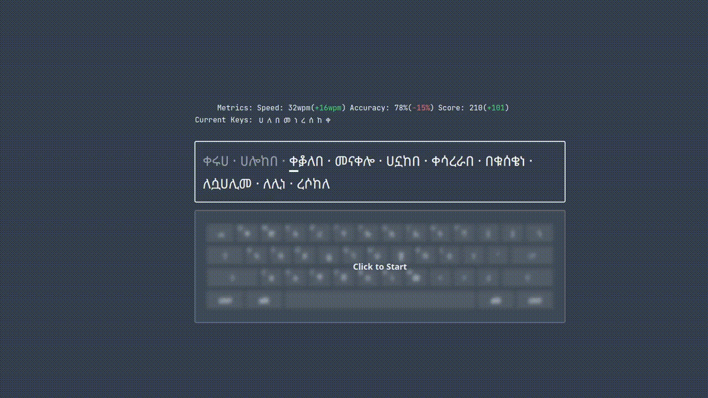

# Fetan - Amharic Touch Typing Tutor

A web-based Amharic typing tutor designed to help users learn touch typing through structured lessons and real-time feedback. Deployed here: [fetan.mesnoy.com](https://fetan.mesnoy.com)



## Getting Started

## Installation and Running

Make sure you have `composer` and `npm` installed and run these commands.

```bash
git clone https://github.com/omer-biz/fetan.git
cd fetan
npm install
composer run dev
```

## Contributing
Contributions are welcom.

1. Fork the project
2. Create your feature branch (`git checkout -b feature/AmazingFeature`)
3. Commit your changes (`git commit -m 'Add some AmazingFeature'`)
4. Push to the branch (`git push origin feature/AmazingFeature`)
5. Open a Pull Request
